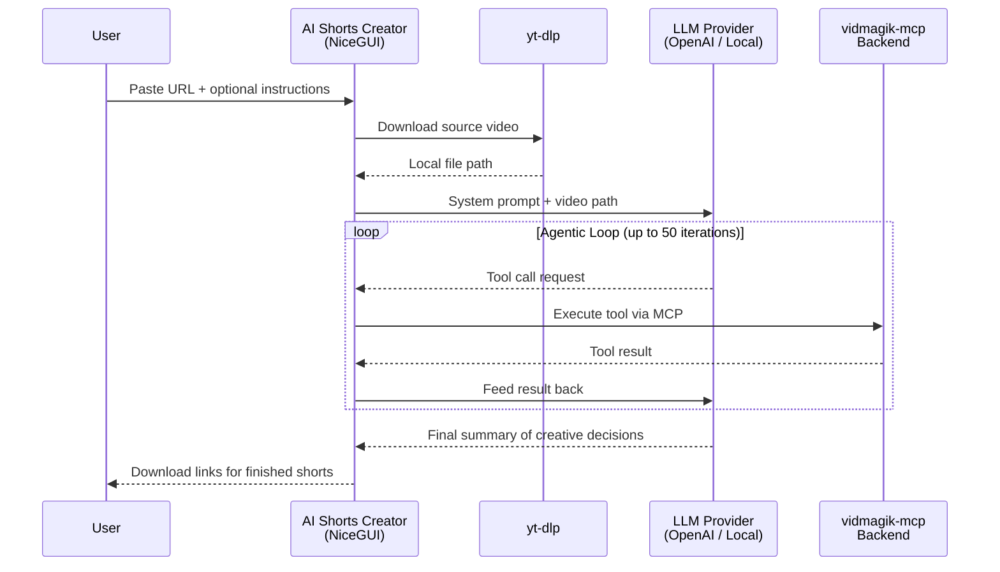

<p align="center">
  <h1 align="center">🎬 vidmagikAgent</h1>
  <p align="center">
    <strong>An AI-powered video editing agent that automatically creates short-form content from any video.</strong>
  </p>
  <p align="center">
    Paste a URL → AI downloads, analyzes, edits, and exports vertical shorts for TikTok, YouTube Shorts & Instagram Reels.
  </p>
  <p align="center">
    <a href="#-quick-start">Quick Start</a> •
    <a href="#-how-it-works">How It Works</a> •
    <a href="#-web-app">Web App</a> •
    <a href="#-mcp-backend">MCP Backend</a> •
    <a href="#-custom-effects">Custom Effects</a> •
    <a href="#-docker">Docker</a> •
    <a href="#-testing">Testing</a>
  </p>
</p>

---

## 📖 Overview

**vidmagikAgent** is a full-stack AI video editing agent that turns any video into polished, platform-ready short-form content — completely autonomously.

The project consists of three major components:

| Component | What It Does |
|---|---|
| **AI Shorts Creator** (`app/`) | A NiceGUI web application — the main user-facing product. Paste a video URL, give optional creative instructions, and the AI agent handles everything: downloading, scene analysis, intelligent clip selection, vertical reframing, effects, and export. |
| **vidmagik-mcp Backend** (`api/main.py`) | An MCP (Model Context Protocol) server exposing **60+ video/audio editing tools** built on MoviePy. This is the "hands" the AI agent uses to actually edit video. |
| **Custom Effects Library** (`api/custom_fx/`) | 9 production-ready visual effects — Matrix rain, kaleidoscope, chroma key, face-tracking auto-framing, 3D rotating cube, and more — that go beyond MoviePy's built-in effects. |

### Key Capabilities

- 🤖 **Fully Autonomous** — The AI agent makes all creative decisions: which moments to pick, how to crop, what effects to apply, when to cut.
- 🌐 **Any Video Source** — Downloads from YouTube, TikTok, Instagram, Twitter, and [1000+ sites](https://github.com/yt-dlp/yt-dlp/blob/master/supportedsites.md) via yt-dlp.
- 📱 **Vertical-First** — Auto-framing with face detection (Haar Cascades) converts 16:9 → 9:16 while keeping subjects centered.
- 🔧 **Any LLM** — Works with OpenAI, Anthropic, local models (LM Studio, Ollama), or any OpenAI-compatible API via LiteLLM.
- 🎨 **60+ Editing Tools** — Full MoviePy API + 9 custom effects, all exposed as MCP tools the agent can call.
- 📡 **Real-Time Streaming UI** — Watch the agent think, call tools, and produce results in a live chat-style activity log.
- 🐳 **Docker Ready** — Multi-service `docker-compose.yml` for one-command deployment.

---

## 🚀 Quick Start

### Prerequisites

| Requirement | Why |
|---|---|
| **Python** ≥ 3.13 | Runtime |
| **[uv](https://docs.astral.sh/uv/)** | Package manager (recommended) |
| **FFmpeg** | Video/audio encoding & decoding (used by MoviePy) |
| **ImageMagick** | Text rendering (for `TextClip`) |

### Install & Run

```bash
# Clone the repo
git clone https://github.com/vizionik25/vidmagik-mcp.git
cd vidmagik-mcp

# Install all dependencies
uv sync

# Launch the AI Shorts Creator web app
uv run app/main.py
# → Opens at http://127.0.0.1:3000
```

### Using the Web App

1. **Configure your LLM** — Set the API base URL, API key, and model name in the "LLM Settings" panel.
   - For **LM Studio**: `http://localhost:1234/v1` / `lm-studio` / `local-model`
   - For **OpenAI**: `https://api.openai.com/v1` / `sk-...` / `gpt-4o`
   - For **Ollama**: `http://localhost:11434/v1` / `ollama` / `llama3`
2. **Paste a video URL** — YouTube, TikTok, Instagram, or any supported site.
3. **Add instructions** (optional) — e.g., *"Focus on the funniest moments, make 3 shorts"*.
4. **Click "Create Shorts"** — The agent downloads the video, analyzes scenes, picks the best clips, reframes for vertical, applies effects, and exports.
5. **Download your shorts** — Exported files appear in the "Exported Shorts" panel with one-click download buttons.

---

## ⚙️ How It Works



### The Agentic Loop

The heart of the project is the **agentic loop** in `app/mcp_client.py`. Here's what happens when you click "Create Shorts":

1. **Download** — `yt-dlp` downloads the video to the `media/` directory.
2. **System Prompt** — The app sends a system prompt to the configured LLM, instructing it to act as an expert video editor.
3. **Tool Calling Loop** — The LLM decides what to do and calls MCP tools:
   - `video_file_clip` → Load the downloaded video
   - `tools_detect_scenes` → Analyze scene boundaries
   - `subclip` → Extract the best 15-60 second segments
   - `vfx_auto_framing` → Crop to 9:16 vertical with face tracking
   - `vfx_fade_in` / `vfx_fade_out` → Smooth transitions
   - `write_videofile` → Export to `media/short_1.mp4`, `short_2.mp4`, etc.
4. **Summary** — The LLM explains its creative choices (why it picked those moments, what effects it applied).
5. **UI Updates** — Every tool call and result streams to the Agent Activity log in real time.

### Architecture Overview

```
vidmagikAgent/
├── app/                         # 🖥  FRONTEND — AI Shorts Creator
│   ├── main.py                  #    NiceGUI web UI (dark mode, real-time log)
│   ├── mcp_client.py            #    MCP client + LLM agentic loop (LiteLLM)
│   └── Dockerfile               #    Frontend Docker image
│
├── api/                         # ⚙️  BACKEND
│   ├── __init__.py              #    Package init
│   ├── main.py                  #    vidmagik-mcp server (60+ MCP tools, prompts, upload route)
│   └── custom_fx/               #  🎨  EFFECTS LIBRARY
│       ├── __init__.py           #    Re-exports all 9 custom effects
│       ├── auto_framing.py       #    Face-tracking vertical crop
│       ├── chroma_key.py         #    Green screen removal
│       ├── clone_grid.py         #    Grid of video clones
│       ├── kaleidoscope.py       #    Radial symmetry
│       ├── kaleidoscope_cube.py  #    Kaleidoscope + rotating cube combo
│       ├── matrix.py             #    "Matrix" digital rain overlay
│       ├── quad_mirror.py        #    Four-quadrant mirror
│       ├── rgb_sync.py           #    RGB channel split / glitch
│       └── rotating_cube.py      #    3D rotating cube with video mapping
│
├── tests/                       # 🧪  TEST SUITE
│   ├── test_e2e.py              #    Backend end-to-end tests
│   ├── test_nicegui_integration.py  # NiceGUI integration tests
│   └── frontend_e2e_test.py     #    Frontend end-to-end tests
│
├── media/                       # 📁  Working directory (gitignored)
├── Dockerfile                   # 🐳  Backend Docker image
├── docker-compose.yml           # 🐳  Multi-service orchestration
├── pyproject.toml               # 📦  Dependencies & config
├── uv.lock                      # 🔒  Locked dependency versions
├── CUSTOM_FX.md                 # 📖  Custom effects documentation
├── LICENSE                      # ⚖️  MIT License
└── inspect_moviepy.py           # 🔍  MoviePy installation checker
```

---

## 🖥 Web App

### UI Sections

The AI Shorts Creator (`app/main.py`) is a dark-themed NiceGUI single-page application with four main sections:

#### 1. LLM Settings (Collapsible)
Configure the LLM backend on the fly — no restart needed:

| Field | Default | Notes |
|---|---|---|
| API Base URL | `http://localhost:1234/v1` | Any OpenAI-compatible endpoint |
| API Key | `lm-studio` | `sk-...` for OpenAI, `ollama` for Ollama, etc. |
| Model | `local-model` | `gpt-4o`, `claude-3-opus`, `llama3`, etc. |

#### 2. Video Source
- **Video URL** — Paste any URL supported by yt-dlp.
- **Instructions** (optional) — Natural language creative direction for the agent.
- **"Create Shorts" button** — Kicks off the entire pipeline.

#### 3. Agent Activity Log
A scrolling, chat-style log that streams the agent's work in real time:
- 🧠 **Thinking** — The LLM's reasoning (gray)
- 🔧 **Tool Calls** — Which MCP tool is being called and with what arguments (violet)
- ✅ **Tool Results** — The result of each tool call (cyan)
- 💬 **Messages** — The LLM's final summary (green)
- ❌ **Errors** — Any failures (red)

#### 4. Exported Shorts
Download cards for each exported video file, with movie icon and one-click download buttons.

### MCP Client (`app/mcp_client.py`)

The `MCPVideoClient` class handles the full lifecycle:

- **Connection** — Spawns the vidmagik-mcp backend as a subprocess over stdio transport.
- **Schema Discovery** — Fetches all MCP tool schemas and converts them to OpenAI function-calling format.
- **Video Download** — Uses `yt-dlp` to download videos with best quality MP4 format.
- **Agentic Loop** — Iterates up to 50 rounds of LLM → tool call → result → LLM, yielding typed events for the UI to render.
- **LiteLLM Integration** — Translates MCP tool schemas to OpenAI format so any OpenAI-compatible model can drive the agent.

---

## ⚙️ MCP Backend

The backend (`api/main.py`) is a [FastMCP](https://github.com/jlowin/fastmcp) server that wraps the entire MoviePy video editing library as MCP tools. It can run in three transport modes:

```bash
# HTTP (default) — for standalone use or HTTP MCP clients
uv run api/main.py --transport http --host 0.0.0.0 --port 8080

# SSE — for Server-Sent Events MCP clients
uv run api/main.py --transport sse

# stdio — for subprocess-based MCP clients (used by the AI Shorts Creator)
uv run api/main.py --transport stdio
```

### Clip Management System

All clips live in an in-memory store (`CLIPS` dict) with a max of **100 concurrent clips**. Every tool that creates or transforms a clip returns a UUID handle:

```
video_file_clip("video.mp4") → "a1b2-..."
subclip("a1b2-...", 10.0, 25.0) → "c3d4-..."
vfx_fade_in("c3d4-...", 1.0) → "e5f6-..."
write_videofile("e5f6-...", "output.mp4") → "Successfully wrote video to output.mp4"
```

### Full Tool Inventory (60+ tools)

<details>
<summary><strong>Clip Management</strong> (5 tools)</summary>

| Tool | Description |
|---|---|
| `validate_path(filename)` | Path validation to prevent directory traversal |
| `register_clip(clip)` | Register a clip and return its UUID |
| `get_clip(clip_id)` | Retrieve a clip by UUID |
| `list_clips()` | List all loaded clips and their types |
| `delete_clip(clip_id)` | Remove a clip from memory |
</details>

<details>
<summary><strong>Video I/O</strong> (10 tools)</summary>

| Tool | Description |
|---|---|
| `video_file_clip(filename, audio, fps_source, target_resolution)` | Load a video file |
| `image_clip(filename, duration, transparent)` | Load an image as a clip |
| `image_sequence_clip(sequence, fps, durations, with_mask)` | Create clip from image sequence or folder |
| `text_clip(text, font, font_size, color, bg_color, size, method, duration)` | Create a text clip (needs ImageMagick) |
| `color_clip(size, color, duration)` | Create a solid color clip |
| `credits_clip(creditfile, width, color, stroke_color, ...)` | Scrolling credits from a text file |
| `subtitles_clip(filename, encoding, font, font_size, color)` | Subtitles from `.srt` file |
| `write_videofile(clip_id, filename, fps, codec, audio_codec, bitrate, preset, ...)` | Export video to file |
| `write_gif(clip_id, filename, fps, loop)` | Export clip as GIF |
| `tools_ffmpeg_extract_subclip(filename, start_time, end_time, targetname)` | Fast FFmpeg extraction (no decoding) |
</details>

<details>
<summary><strong>Audio I/O</strong> (2 tools)</summary>

| Tool | Description |
|---|---|
| `audio_file_clip(filename, buffersize)` | Load an audio file |
| `write_audiofile(clip_id, filename, fps, nbytes, codec, bitrate)` | Export audio to file |
</details>

<details>
<summary><strong>Clip Configuration</strong> (6 tools)</summary>

| Tool | Description |
|---|---|
| `set_position(clip_id, x, y, pos_str, relative)` | Set clip position |
| `set_audio(clip_id, audio_clip_id)` | Set video's audio track |
| `set_mask(clip_id, mask_clip_id)` | Set transparency mask |
| `set_start(clip_id, t)` | Set start time |
| `set_end(clip_id, t)` | Set end time |
| `set_duration(clip_id, t)` | Set duration |
</details>

<details>
<summary><strong>Compositing & Arrangement</strong> (6 tools)</summary>

| Tool | Description |
|---|---|
| `subclip(clip_id, start_time, end_time)` | Cut a portion of a clip |
| `composite_video_clips(clip_ids, size, bg_color, use_bgclip)` | Overlay/compose clips |
| `tools_clips_array(clip_ids_rows, bg_color)` | Arrange clips in a grid |
| `concatenate_video_clips(clip_ids, method, transition)` | Concatenate clips |
| `composite_audio_clips(clip_ids)` | Mix audio clips |
| `concatenate_audio_clips(clip_ids)` | Concatenate audio clips |
</details>

<details>
<summary><strong>Built-in Video Effects</strong> (32 tools)</summary>

| Tool | Description |
|---|---|
| `vfx_accel_decel` | Accelerate / decelerate playback |
| `vfx_black_white` | Convert to black and white |
| `vfx_blink` | Blink on/off |
| `vfx_crop` | Crop region |
| `vfx_cross_fade_in` / `vfx_cross_fade_out` | Cross-fade transitions |
| `vfx_even_size` | Ensure even pixel dimensions |
| `vfx_fade_in` / `vfx_fade_out` | Fade from/to black |
| `vfx_freeze` / `vfx_freeze_region` | Freeze frame or region |
| `vfx_gamma_correction` | Adjust gamma |
| `vfx_head_blur` | Blur a moving point (math expressions) |
| `vfx_invert_colors` | Invert colors |
| `vfx_loop` | Loop a clip |
| `vfx_lum_contrast` | Luminosity & contrast |
| `vfx_make_loopable` | Seamless loop with fade |
| `vfx_margin` | Add border/margin |
| `vfx_mask_color` | Create mask from color |
| `vfx_masks_and` / `vfx_masks_or` | Logical mask operations |
| `vfx_mirror_x` / `vfx_mirror_y` | Mirror horizontally/vertically |
| `vfx_multiply_color` | Color intensity |
| `vfx_multiply_speed` | Playback speed |
| `vfx_painting` | Oil painting effect |
| `vfx_resize` | Resize clip |
| `vfx_rotate` | Rotate clip |
| `vfx_scroll` | Scrolling viewport |
| `vfx_slide_in` / `vfx_slide_out` | Slide transitions |
| `vfx_supersample` | Anti-aliasing |
| `vfx_time_mirror` | Reverse playback |
| `vfx_time_symmetrize` | Play forward then reverse |
</details>

<details>
<summary><strong>Custom Video Effects</strong> (9 tools)</summary>

| Tool | Description |
|---|---|
| `vfx_auto_framing(clip_id, target_aspect_ratio, smoothing)` | Face-tracking vertical crop |
| `vfx_chroma_key(clip_id, color, threshold, softness)` | Green screen removal |
| `vfx_clone_grid(clip_id, n_clones)` | Grid of video clones |
| `vfx_kaleidoscope(clip_id, n_slices, x, y)` | Radial symmetry |
| `vfx_kaleidoscope_cube(clip_id, kaleidoscope_params, cube_params)` | Combined kaleidoscope + cube |
| `vfx_matrix(clip_id, speed, density, chars, color, font_size)` | Matrix digital rain |
| `vfx_quad_mirror(clip_id, x, y)` | Four-quadrant mirror |
| `vfx_rgb_sync(clip_id, r/g/b_offset, r/g/b_time_offset)` | RGB channel split glitch |
| `vfx_rotating_cube(clip_id, speed, direction, zoom)` | 3D rotating cube |
</details>

<details>
<summary><strong>Audio Effects</strong> (7 tools)</summary>

| Tool | Description |
|---|---|
| `afx_audio_delay(clip_id, offset, n_repeats, decay)` | Echo / delay |
| `afx_audio_fade_in` / `afx_audio_fade_out` | Fade in/out |
| `afx_audio_loop(clip_id, n_loops, duration)` | Loop audio |
| `afx_audio_normalize(clip_id)` | Normalize levels |
| `afx_multiply_stereo_volume(clip_id, left, right)` | Stereo balance |
| `afx_multiply_volume(clip_id, factor)` | Volume control |
</details>

<details>
<summary><strong>Analysis & Utility</strong> (7 tools)</summary>

| Tool | Description |
|---|---|
| `tools_detect_scenes(clip_id, luminosity_threshold)` | Detect scene boundaries |
| `tools_find_video_period(clip_id, start_time)` | Find video repeating period |
| `tools_find_audio_period(clip_id)` | Find audio repeating period |
| `tools_drawing_color_gradient(size, p1, p2, col1, col2, shape, offset)` | Generate gradient image |
| `tools_drawing_color_split(size, x, y, p1, p2, col1, col2, grad_width)` | Generate color split image |
| `tools_file_to_subtitles(filename, encoding)` | Parse `.srt` subtitle file |
| `tools_check_installation()` | Verify MoviePy + FFmpeg install |
</details>

### Prompt Templates

Pre-built prompt presets for common creative workflows:

| Prompt | Use Case |
|---|---|
| `demonstrate_kaleidoscope(clip_id)` | 8-slice kaleidoscope for psychedelic visuals |
| `glitch_effect_preset(clip_id)` | High-energy RGB split glitch for music videos |
| `matrix_intro_preset(clip_id)` | Matrix digital rain for tech/hacker intros |
| `auto_framing_for_tiktok(clip_id)` | Vertical 9:16 with face tracking |
| `rotating_cube_transition(clip_id)` | 3D cube scene transition |
| `slideshow_wizard(images, ...)` | Slideshow with transitions, text overlays, configurable resolution |
| `title_card_generator(text, ...)` | Title card with solid background and typography |
| `demonstrate_kaleidoscope_cube(clip_id, ...)` | Combined kaleidoscope + cube demo |

### File Upload API

The backend exposes a custom HTTP endpoint for direct file uploads:

```bash
curl -X POST http://localhost:8080/upload -F "file=@/path/to/video.mp4"
# → {"filename": "/app/video.mp4", "size": 12345678}
```

---

## 🎨 Custom Effects

All 9 custom effects are in `api/custom_fx/` and follow the MoviePy `Effect` protocol. Full parameter documentation is in [CUSTOM_FX.md](CUSTOM_FX.md).

| Effect | File | What It Does |
|---|---|---|
| **Auto Framing** | `auto_framing.py` | Face-tracking crop for vertical video. Uses Haar Cascades + exponential smoothing for cinematic tracking. Ideal for landscape → portrait conversion. |
| **Matrix Rain** | `matrix.py` | Falling character overlay with bright leading edge and fading trails. Configurable speed, density, charset, color. |
| **Kaleidoscope** | `kaleidoscope.py` | Radial symmetry — mirrors a wedge around a center point. Configurable slice count and center. |
| **RGB Sync** | `rgb_sync.py` | Splits RGB channels with independent spatial (px) and temporal (seconds) offsets. Chromatic aberration / glitch aesthetic. |
| **Chroma Key** | `chroma_key.py` | Green screen removal via Euclidean distance masking. Configurable threshold and softness. |
| **Clone Grid** | `clone_grid.py` | Tiles video in auto-calculated grid layout. Supports 2–64+ clones. |
| **Quad Mirror** | `quad_mirror.py` | Four-quadrant symmetry around a configurable center point. |
| **Rotating Cube** | `rotating_cube.py` | 3D cube with video on all faces. Multi-axis rotation, optional quad-mirroring, circular motion paths. |
| **KaleidoscopeCube** | `kaleidoscope_cube.py` | Compound effect: Kaleidoscope → Rotating Cube with independent config for each stage. |

---

## 🐳 Docker

### One-Command Deployment

```bash
# Build and start everything
docker compose up --build

# Just the web app (includes MCP backend as subprocess)
docker compose up shorts-creator

# Just the MCP backend standalone
docker compose up vidmagik-mcp
```

### Services

| Service | Description | Port | Dockerfile |
|---|---|---|---|
| `shorts-creator` | AI Shorts Creator web app | `3000` | `app/Dockerfile` |
| `vidmagik-mcp` | MCP server (stdio mode) | — | `Dockerfile` |

### Docker Details

**Backend image** (`Dockerfile`):
- Base: `python:3.12-slim`
- System deps: `ffmpeg`, `imagemagick`, `libsm6`, `libxext6`, `libgl1`
- Auto-patches ImageMagick policy for TextClip support
- Package manager: `uv` (install + sync from lockfile)

**Frontend image** (`app/Dockerfile`):
- Base: `python:3.12-slim`
- System deps: `ffmpeg`
- Exposes port `3000`

**Shared volume**: `./media:/app/media` — both services share video files.

### Environment Variables

| Variable | Default | Description |
|---|---|---|
| `PYTHONUNBUFFERED` | `1` | Disable output buffering |
| `NICEGUI_HOST` | `127.0.0.1` | NiceGUI bind address (`0.0.0.0` in Docker) |
| `HOST` | `0.0.0.0` | MCP server bind address |
| `PORT` | `8080` | MCP server port |

---

## 🧪 Testing

### Test Suite

| File | Scope |
|---|---|
| `tests/test_e2e.py` | Backend MCP tools — end-to-end tests |
| `tests/test_nicegui_integration.py` | NiceGUI UI component integration tests |
| `tests/frontend_e2e_test.py` | Full frontend end-to-end tests |

### Running Tests

```bash
# All tests
uv run pytest

# With coverage
uv run pytest --cov=. --cov-report=term-missing

# Specific module
uv run pytest tests/test_e2e.py -v
```

Pytest config (`pyproject.toml`):
```toml
[tool.pytest.ini_options]
asyncio_mode = "auto"
```

---

## 📦 Dependencies

### Runtime

| Package | Purpose |
|---|---|
| [FastMCP](https://github.com/jlowin/fastmcp) ≥ 3.0.0 | MCP server framework |
| [MoviePy](https://zulko.github.io/moviepy/) ≥ 2.2.1 | Video editing engine |
| [LiteLLM](https://github.com/BerriAI/litellm) ≥ 1.40.0 | Universal LLM API client (OpenAI, Anthropic, local, etc.) |
| [NiceGUI](https://nicegui.io/) ≥ 2.0.0 | Web UI framework for the Shorts Creator |
| [OpenCV](https://opencv.org/) (headless) ≥ 4.13.0 | Computer vision — face detection for auto-framing |
| [NumExpr](https://github.com/pydata/numexpr) ≥ 2.14.1 | Safe math expression evaluation (HeadBlur effect) |
| [yt-dlp](https://github.com/yt-dlp/yt-dlp) ≥ 2024.0.0 | Video downloading from 1000+ sites |

### Dev

| Package | Purpose |
|---|---|
| [pytest](https://docs.pytest.org/) ≥ 9.0.2 | Testing framework |
| [pytest-asyncio](https://github.com/pytest-dev/pytest-asyncio) ≥ 1.3.0 | Async test support |
| [pytest-cov](https://github.com/pytest-dev/pytest-cov) ≥ 7.0.0 | Coverage reporting |
| [httpx](https://www.python-httpx.org/) ≥ 0.28.1 | HTTP client for testing |

### System

- **FFmpeg** — Required by MoviePy for all encoding/decoding
- **ImageMagick** — Required for text rendering (`TextClip`)

---

## 🛠 Development

### Adding a New Custom Effect

1. Create `api/custom_fx/my_effect.py`:

```python
from moviepy import Effect
import numpy as np

class MyEffect(Effect):
    """Description of your effect."""

    def __init__(self, intensity: float = 1.0):
        self.intensity = intensity

    def apply(self, clip):
        def filter(get_frame, t):
            frame = get_frame(t)
            # Transform the frame here
            return frame
        return clip.transform(filter)
```

2. Export from `api/custom_fx/__init__.py`:

```python
from .my_effect import MyEffect
```

3. Add MCP tool in `api/main.py`:

```python
@mcp.tool
def vfx_my_effect(clip_id: str, intensity: float = 1.0) -> str:
    """Description of your custom effect."""
    clip = get_clip(clip_id)
    return register_clip(clip.with_effects([MyEffect(intensity)]))
```

### Server CLI Reference

```
usage: api/main.py [-h] [--transport {stdio,sse,http}] [--host HOST] [--port PORT]

vidMagik MCP Server

options:
  --transport {stdio,sse,http}  Transport type (default: http)
  --host HOST                   Host for HTTP/SSE (default: 0.0.0.0)
  --port PORT                   Port for HTTP/SSE (default: 8080)
```

---

## 📄 License

[MIT License](LICENSE) — Copyright © 2026 vizionik25
